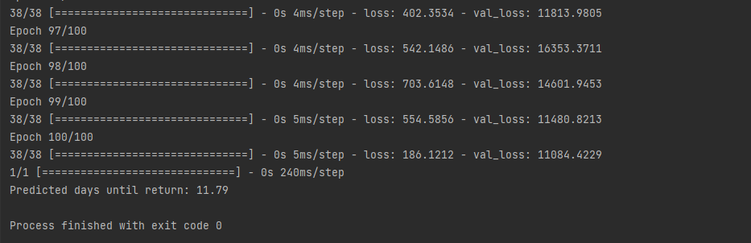

# data-analyst-task

-	Data Analyst Task

SCOPE
1.	Data Processing 
2.	Data Analysis 
3.	Prediction Model

STEPS
1.	Create Directories: `data`, `temp`
2.	Import source files into `./data`
3.	Import .py scripts 
4.	To run Data Processing (necessary for steps 5 and 6)
 4.1.	Run `pre_processing.py` script
 4.2.	In case you did not manage to successfully run `pre_processing.py` - comment rows 129-144 in `data_processing.py` script and proceed
 4.3.	Run `data_processing.py`- script performs data cleaning and saves new cleaned files into `.temp` folder
5.	To run Data Analysis: 
 5.1.	Run `data_analysis.py` script
6.	To run Prediction Model:
 6.1.	Open `prediction_model.py` script
 6.2.	Scroll to rows 102-124
 6.3.	Input relevant data for prediction model
 6.4.	Run the script

PROCESS OVERVIEW
0. __Assessment and Planning__
 After reviewing the data and understanding the task, it became clear that the project needs to be completed in several phases. The first phase is data cleaning, which is a prerequisite for the next steps: data analysis with visualization and predictive modelling. As this is my first Python-based project and Python was not part of my skillset yet, I was focused to explore technology as much as possible.
1. __Data Processing - Data Cleaning__
 Defined and performed various data cleaning steps such as handling missing values (decided not to go with `df.dropna(inplace=True)` and remove only outliers), change data types, standardising values, removing special characters, whitespace removal, number and dates formatting. Also performed some data manipulation steps such as filtering data, adding new calculated columns, renaming current column names (to avoid having the same column names in all tables, or to make clearer those are to be used as foreign keys), adding new Id column as a primary key. Rows with outliers (date) are being removed to keep relevant data only. Here I made couple of assumptions: defined outliers in this case and interpretation of null values in some cases and populated missing values. Hardcoded mappings were used for some geo value.
The last step in this work scope was exporting data – saving cleaned new files to be used in next steps. I left comments in the code for each action performed for me to easier manage through code, but some of the comments are obsolete lines I used to test output and possibilities. I decided to keep some of them, so it provides more insights in work done.
 1.1.	__Note__: Populated geolocation data from a separate file due to issues with `geopy.geocoders` during development. Pre-processing step was introduced as a workaround after longer time desperately trying to troubleshoot initial, more elegant, approach.
 1.1.1.	__Fun fact__: Some Python functions were disrupted due to specific SSL certificates required for reading Serbian IDs, affecting `geolocator.geocode`. This issue, and occasional 403 errors, were resolved with workaround after extensive troubleshooting with references like this [GitHub discussion]( https://github.com/Sygil-Dev/sygil-webui/discussions/1325#discussioncomment-8150646) and Nominatim status checks: https://nominatim.org/release-docs/latest/api/Status/ . Besides this, sometimes error 403 can occur, so in case pre-processing step does not work, some lines from processing script should be removed.
 1.2.	__Room for improvement__: 
 1.2.1.	Implement geocode part of data cleaning into one wholesome script. Currently, we have half automated process instead of fully automated one. Also, I expect this to enable lots of data analysis and visualisation possibilities that I’m yet to explore.
 1.2.2.	Implement naming nomenclature – although in this case column names serve purpose, implementing naming nomenclature would be beneficial as long-term solution and is easy to implement. 
 1.2.3.	Some columns with brackets were not reformatted. A potential enhancement could involve separating values in one of these columns and analysing correlations.
2. __Data Analysis__ 
 Tables joined in star schema using left join. 
 During this process, I concentrated on using Python to explore the data, which may not have been the most efficient approach. Each attempt took considerable time instead of allowing for a quicker basic data investigation. I made a deliberate choice to prioritize this method compared to using familiar tools, as my primary goal was to deepen my understanding of the tool I was using. 
 2.1.	__Data analysis and insights__
 I conducted an in-depth data analysis to explore various combinations of categories, aiming to uncover potential insights and identify patterns in correlations. However, I did not arrive at definitive conclusions regarding any significant factors linked to late returns. I chose not to impose conclusions based on superficial differences, prioritizing a thorough and thoughtful examination of the findings instead.
 Created couple visuals during analysis located in – `data_analysis.py` script - report with charts to test visuals.
 Time spent on actual analysis is much lower compared to actual python learning, and I am not fully satisfied with results of an actual analysis.
 2.2.	__Room for improvement__:
 2.2.1.	Experiment with various libraries for data analysis such as Matplotlib, Seaborn, Plotly, Scikit-learn, SciPy,  Geopandas… By effectively leveraging these libraries and methods, I expect i could more effectively explore and visualize correlations in data, allowing deeper insights and better-informed conclusions.
3. __Prediction Model__
 This was the first time for me to work with predictive models, and it took a lot of investigation on this topic. My previous knowledge was only that there are famous libraries for this topic as PyTorch and TensorFlow. I decided to use TensorFlow.
 I was able to find sufficient information online regarding data preparation for modeling, including transforming and splitting data into numerical and categorical features, adjusting the desired data format, and running the model. I learned some basic concepts related to prediction modelling - what epoch, loss, test and training set... However, I acknowledge that my understanding in this area is still quite limited. 
 3.1.	__Room for improvement__: There is lot room for improvement here: to understand more about machine learning and neural network.

4. __Conclusion__
 After six days on this project, and an uneven time distribution: the first day focused on planning, the next two days on familiarizing myself with basic Python functions, and the remaining 3 days on intensive work. This experience confirmed that it is feasible to gain a foundational understanding of a new tool or technology within a week. My main focus was on understanding Python syntax and understand how libraries are utilized while implementing steps I had conceptually defined previously, rather than on producing the final output. Through this, I gained insights into multiple different Python concepts previously unfamiliar.
 4.1. __Business Questions__: As mentioned in Data Analysis segment -  Although I did investigate different categories and factors, percentage of books with late return or never returned, geographical distribution, and various criteria correlations, I did not reach definitive conclusions regarding significant correlation factors associated with late returns and I refrained from drawing forced conclusions. I identified some interested insights from the data analysis which I am ready to discuss. However, my recommendations for conclusions are more functional than analytical. I suggest implementing a system to track latency and notify users with reminders about overdue items. This approach could potentially encourage younger users to engage more actively.
5. __References__ (some of those did not become part of the task solution)
•	https://www.w3schools.com/python/default.asp
•	https://matplotlib.org/
•	https://matplotlib.org/stable/gallery/lines_bars_and_markers/index.html
•	https://plotly.com/graphing-libraries/
•	https://en.wikipedia.org/wiki/TensorFlow
•	https://en.wikipedia.org/wiki/PyTorch
•	https://en.wikipedia.org/wiki/Correlation_coefficient
•	https://en.wikipedia.org/wiki/Euclidean_distance
•	https://docs.scipy.org/doc/scipy/reference/generated/scipy.interpolate.Rbf.html
•	https://docs.scipy.org/doc/scipy/reference/generated/scipy.interpolate.RBFInterpolator.html#scipy.interpolate.RBFInterpolator
•	https://docs.scipy.org/doc/scipy/reference/generated/scipy.interpolate.RBFInterpolator.html#scipy.interpolate.RBFInterpolator
•	
